<h1>
	
	Hey there, nice to see you.
</h1>

	<a href="https://x.com/Envoy_1084" target="_blank"
		>
	<a href="https://www.linkedin.com/in/vedant-chainani/" target="_blank"
		>
	<a href="mailto:vedantchainani1084@gmail.com" target="_blank"
		>
	<a
		href="https://marketplace.visualstudio.com/publishers/Envoy1084"
		target="_blank"
		></a
	>
	
	

 

Hi, I'm [Vedant Chainani](https://envoy1084.xyz.com/), a Web3 Developer 🚀 and Technical Writer from India. I've been in web3 space for around 3 years shipping cool products, attending IRL Events and participating in Hackathons.
 

About Me...

- ⛴️ I love shipping products and learning new technologies.
- 👨🏻‍💻 I love to participate in hackathons.
- 📚 I also write technical articles on my [blog](https://blog.envoy1084.xyz).
- 🏴‍☠️ Currently Building a Secure Battleship Game on Nillion Network.
- 📫 Reach me at: [vedantchainani1084@gmail.com](mailto:vedantchainani1084@gmail.com)
- 🌐 Learn More at: [envoy1084.xyz](https://envoy1084.xyz)

## Github Stats

<table><tr><td valign="top" width="50%">

 

</td><td valign="top" width="50%">

</td></tr></table>

<table><tr><td valign="top" width="50%">

</td><td valign="top" width="50%">

</td></tr></table>

## 📊 Development Breakdown

## Project Time

---

